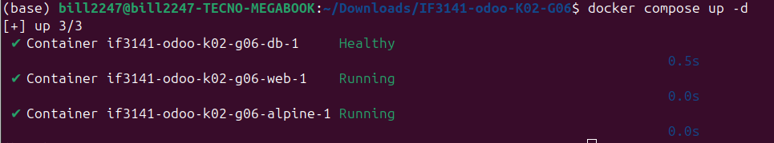
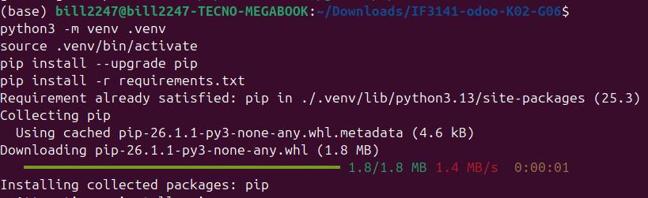
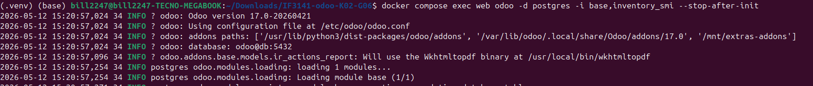
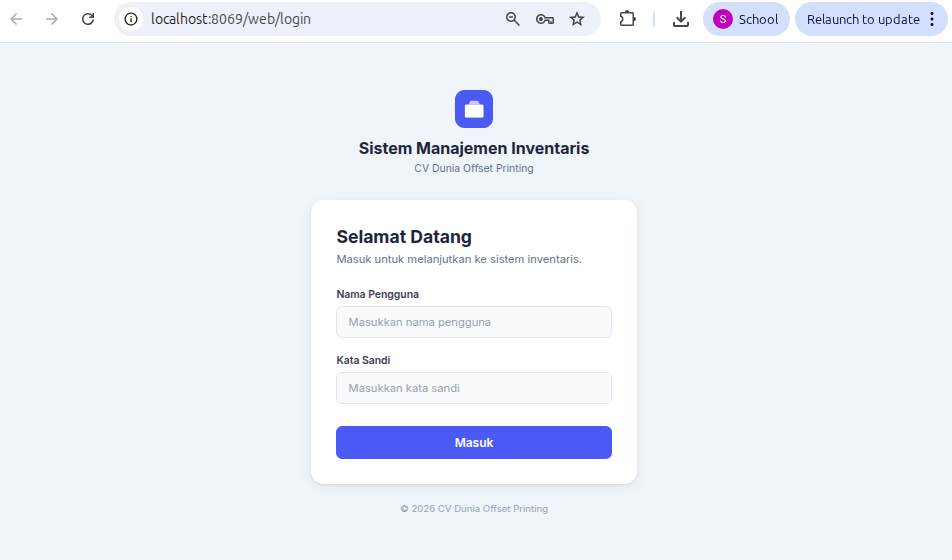
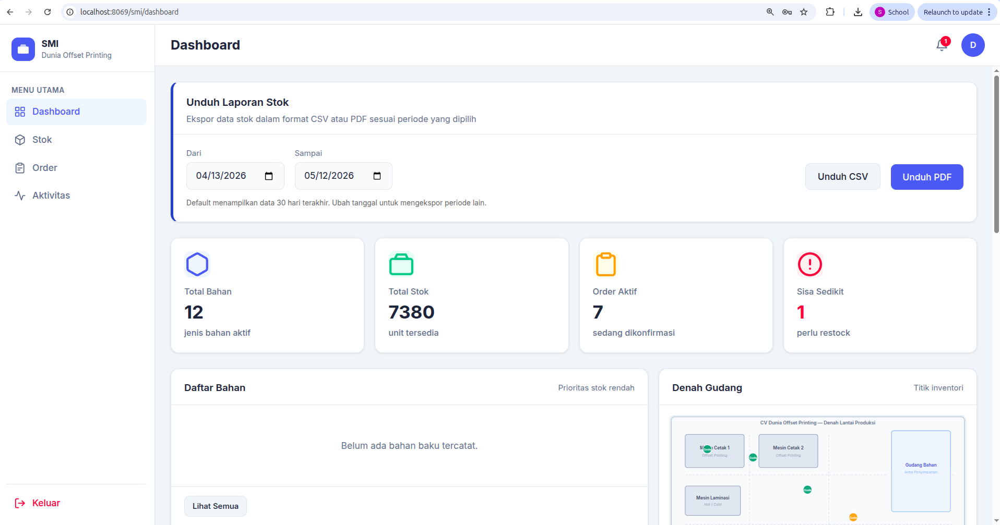

# README — Kelompok G06 (K02)

## Identitas Kelompok
- Nomor Kelompok: G06
- Nomor Kelas: K02

Anggota:
- 13523072  Sabilul Huda
- 13523084  Lutfi Hakim Yusra
- 13523118  Farrel Athalla Putra
- 13523120  Bevinda Vivian
- 13523122  Naomi Risaka Sitorus

---

## Nama Sistem & Perusahaan
- Nama Sistem: Sistem Manajemen Inventori (SMI)
- Perusahaan: CV Dunia Offset Printing
- Logo perusahaan:  
---

## Deskripsi Sistem
Sistem Manajemen Inventaris (SMI) berfungsi sebagai pusat informasi yang mengintegrasikan aliran stok dalam operasional kesehariannya. Data operasional yang mencakup penerimaan stok baru, rincian pesanan, perintah pengeluaran stok, serta penentuan titik lokasi inventori diperbarui secara aktif oleh Kepala Produksi dan Staf Produksi. Sebagai aktor dengan wewenang konfigurasi, Kepala Produksi juga menginput batas stok minimum serta menerima output berupa visualisasi denah interaktif dan laporan stok real-time melalui dashboard.

Di sisi administratif, Admin bertanggung jawab dalam pengelolaan akun pengguna dan mengamati informasi sistem melalui logging untuk menentukan kesehatan aplikasi. Direktur mendapatkan laporan stok periodik dalam bentuk file yang digunakan sebagai bahan evaluasi strategis perusahaan. Alur data yang mengalir dari SMI menuju aktor yang terlibat dan sebaliknya direpresentasikan dalam Context Diagram (tempatkan diagram di bawah ini jika tersedia).

**Context Diagram:** 


---

## Cara Menjalankan Sistem (ringkasan langkah)
Berikut langkah persiapan dan menjalankan sistem pada lingkungan development berbasis Docker. Saya akan menyertakan placeholder screenshot expected result untuk setiap langkah — silakan paste screenshot yang sesuai di tempat yang disediakan.

Langkah-langkah:

1. Clone repository

```bash
git clone <url-repository>
cd IF3141-odoo-K02-G06
```

Expected result: folder project tersedia dan struktur file terlihat.


2. Jalankan Docker services

```bash
docker compose up -d
```

Expected result: container `web` (Odoo) dan `db` (Postgres) berjalan; Odoo tersedia di `http://localhost:8069`.



3. (Opsional) Buat virtualenv untuk pengembangan modul

```bash
python3 -m venv .venv
source .venv/bin/activate
pip install --upgrade pip
pip install -r requirements.txt
```

Expected result: virtualenv aktif dan dependency terpasang.



4. Jalankan seeding (pastikan container sudah jalan). Seeding modul termasuk demo users akan dieksekusi saat upgrade module — gunakan perintah berikut untuk memastikan data demo & seed dimuat:

```bash
docker compose exec web odoo -d postgres -i base,inventory_smi --stop-after-init
```

Catatan: perintah ini memaksa Odoo memuat modul `inventory_smi` dan `base` sehingga data demo (`data/demo_users.xml`, `data/seed_materials.xml`, dsb.) akan dieksekusi.

Expected result: Log Odoo menunjukan bahwa data `demo_users`, `seed_materials`, dan seed lainnya berhasil dimuat.



5. Buka aplikasi di browser

```
http://localhost:8069
```

Expected result: halaman login Odoo (custom template SMI) muncul.



6. Login dan verifikasi role specific pages
Login ke salah satu credential yang tersedia dan pastikan halaman sesuai dengan role yang digunakan.

Expected result: setiap role melihat menu dan halaman sesuai haknya.

Direktur:


Kepala Produksi:


Staff Produksi:


Administrator SMI:


---

## Kredensial (satu akun per role)
Gunakan satu akun per role berikut (akun demo ada di `data/demo_users.xml`):

- Admin SMI
  - Username: `admin_smi`
  - Password: `admin123`

- Kepala Produksi
  - Username: `kepala`
  - Password: `kepala123`

- Staf Produksi
  - Username: `staf1`
  - Password: `staf123`

- Direktur
  - Username: `direktur`
  - Password: `direktur123`

> Catatan: akun `admin` Odoo bawaan juga ada (admin/admin) namun grup SMI berbeda; gunakan kredensial demo di atas untuk menguji fitur SMI spesifik.

## Kesimpulan dan Saran (singkat)
Sistem Manajemen Inventaris (SMI) menyediakan alur kerja komprehensif untuk pencatatan penerimaan dan pengeluaran bahan, pengaturan lokasi penyimpanan, manajemen pengguna berbasis peran, serta pelaporan stok melalui dashboard interaktif. Untuk deployment production, disarankan untuk:

- Menghapus atau tidak menyimpan password dalam bentuk plaintext pada kolom `smi_plain_password` (gunakan only hashed passwords).
- Mengamankan layanan Docker serta konfigurasi `odoo.conf` dengan variable sensitif di environment atau secret manager.
- Menjalankan backup rutin database dan filestore, serta menguji prosedur import/export secara periodik.

---