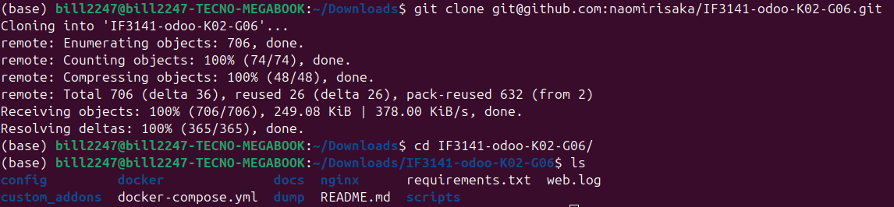
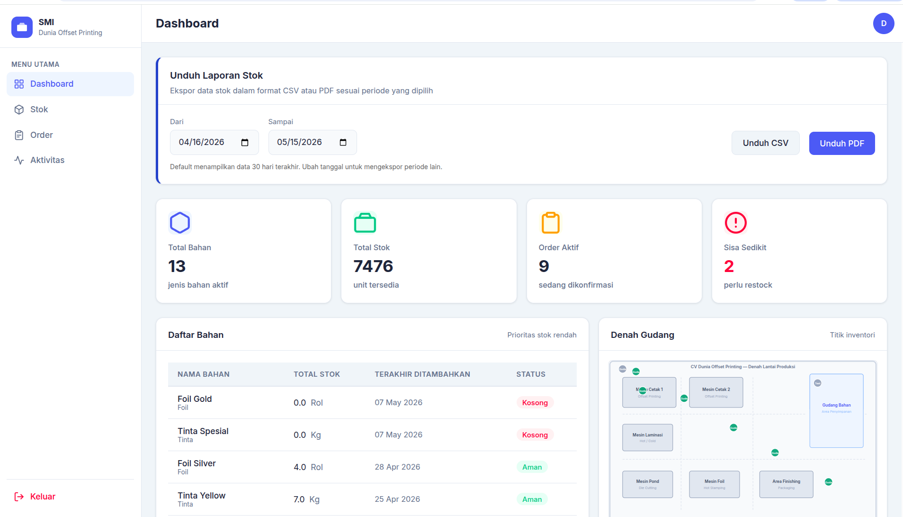
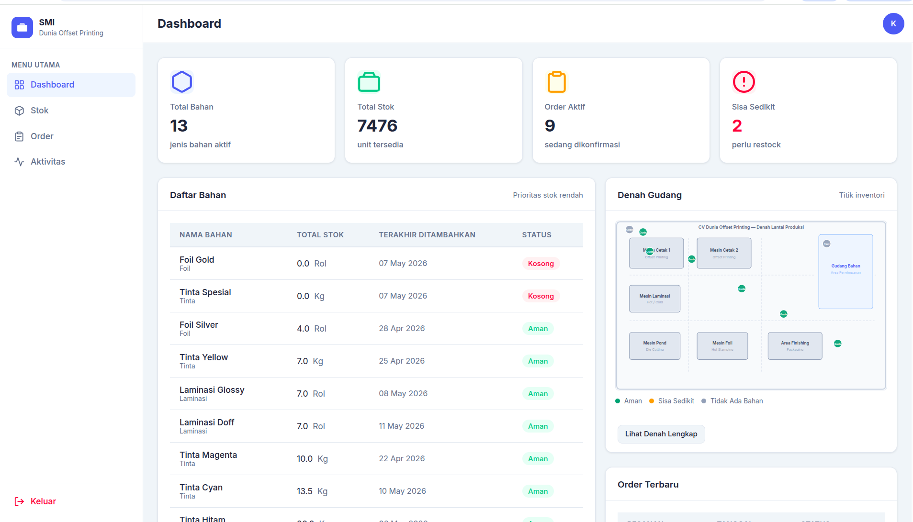
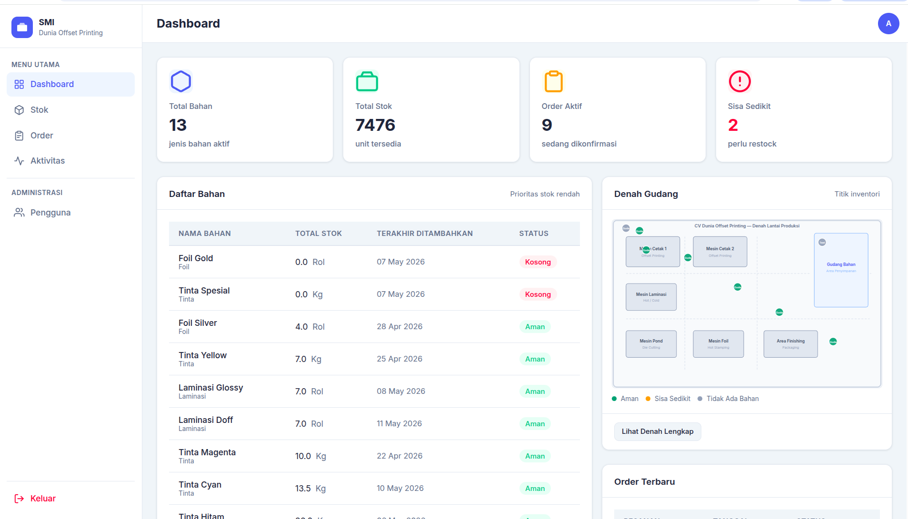
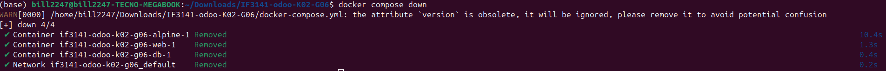

<div align="center">
  <h1>Sistem Manajemen Inventaris (SMI)</h1>
  <p><em>Proyek ini dibuat untuk memenuhi Tugas Besar IF3141 Sistem Informasi</em></p>
</div>

## Identitas Kelompok
**Nomor Kelompok:** G06<br/>
**Nomor Kelas:** K02
<table align="center">
  <tr>
    <td align="center">
      <a href="https://github.com/bill2247">
        <br />
        <b>Sabilul Huda</b><br/>
        <sub>13523072</sub>
      </a>
    </td>
    <td align="center">
      <a href="https://github.com/pixelatedbus">
        <br />
        <b>Lutfi Hakim Yusra</b><br/>
        <sub>13523084</sub>
      </a>
    </td>    
    <td align="center">
      <a href="https://github.com/farrelathalla">
        <br />
        <b>Farrel Athalla Putra</b><br/>
        <sub>13523118</sub>
      </a>
    </td>
    <td align="center">
      <a href="https://github.com/bevindav">
        <br />
        <b>Bevinda Vivian</b><br/>
        <sub>13523120</sub>
      </a>
    </td>
    <td align="center">
      <a href="https://github.com/naomirisaka">
        <br />
        <b>Naomi Risaka Sitorus</b><br/>
        <sub>13523122</sub>
      </a>
    </td>
  </tr>
</table>

---

## Nama Sistem & Perusahaan
**Nama Sistem:** Sistem Manajemen Inventori (SMI)<br/>
**Perusahaan:** CV Dunia Offset Printing<br/>
 

---

## Deskripsi Sistem
Sistem Manajemen Inventaris (SMI) merupakan aplikasi berbasis web yang dirancang untuk membantu CV Dunia Offset Printing dalam mengelola inventaris bahan baku secara terintegrasi dan real-time. Sistem ini mendukung proses operasional mulai dari pencatatan stok masuk, pengelolaan pesanan produksi, pengurangan stok menggunakan metode FIFO, hingga monitoring kondisi inventaris melalui dashboard dan visualisasi denah penyimpanan.

Dalam operasionalnya, Kepala Produksi dan Staf Produksi bertugas memperbarui data inventaris, mengelola kebutuhan material pesanan, serta memantau lokasi penyimpanan bahan baku melalui antarmuka denah interaktif. Admin bertanggung jawab dalam pengelolaan akun pengguna dan pemantauan aktivitas sistem, sementara Direktur menggunakan laporan stok sebagai bahan evaluasi dan pengambilan keputusan operasional. Dengan sistem ini, proses pengelolaan inventaris yang sebelumnya dilakukan secara manual dapat menjadi lebih terstruktur, akurat, dan mudah dipantau.

Untuk menggambarkan hubungan antara sistem dengan seluruh aktor yang terlibat, aliran data pada Sistem Manajemen Inventaris (SMI) direpresentasikan melalui Context Diagram berikut.


---

## Cara Menjalankan Sistem
Berikut langkah persiapan dan menjalankan sistem pada lingkungan development berbasis Docker.

Langkah-langkah:
1. Clone repository

```bash
git clone https://github.com/naomirisaka/IF3141-Implementasi-K02-G06.git
cd IF3141-Implementasi-K02-G06
```

Expected result: folder project tersedia dan struktur file terlihat.



2. Jalankan Docker services

```bash
docker compose up -d --build
```

Expected result: container `web` (Odoo) dan `db` (Postgres) berjalan; Odoo tersedia di `http://localhost:8069`.


3. (Opsional) Buat virtual environment untuk menjalankan sistem.

```bash
python3 -m venv .venv
source .venv/bin/activate
pip install --upgrade pip
pip install -r requirements.txt
```

Expected result: virtualenv aktif dan dependency terpasang.


4. Jalankan seeding (pastikan container sudah jalan). Seeding modul termasuk demo users akan dieksekusi saat upgrade module.

```bash
docker compose exec web odoo -d postgres -i base,inventory_smi --stop-after-init
docker compose restart web
```

>Catatan: Perintah ini memaksa Odoo memuat modul `inventory_smi` dan `base` sehingga data demo (`data/demo_users.xml`, `data/seed_materials.xml`, dsb.) akan dieksekusi.

Expected result: Log Odoo menunjukan bahwa data `demo_users`, `seed_materials`, dan seed lainnya berhasil dimuat.


5. Buka aplikasi di browser

```bash
http://localhost:8069
```

Expected result: halaman login Odoo (custom template SMI) muncul.


6. Login akun dan akses SMI
Login ke salah satu kredensial yang tersedia dan pastikan halaman sesuai dengan role yang digunakan.

Expected result: setiap role melihat menu dan halaman sesuai haknya.

Direktur:


Kepala Produksi:


Staff Produksi:


Administrator SMI:



7. Setelah selesai, hentikan Docker services
```bash
docker compose down
```

>Catatan: gunakan `docker compose down -v` jika ingin sekaligus menghapus volume database dan seluruh data lokal container.

Expected result: seluruh container Docker (web dan db) berhenti dan network project dibersihkan.



---

## Kredensial Tiap Role
Berikut merupakan kredensial akun demo untuk tiap peran/role (akun demo lengkapnya tersedia di `data/demo_users.xml`):

| Nama | Username | Password | Peran |
|------|----------|----------|-------|
| Admin SMI | `admin_smi` | `admin123` | Admin |
| Kepala Produksi | `kepala` | `kepala123` | Kepala Produksi |
| Staf Produksi | `staf1` | `staf123` | Staf Produksi |
| Direktur | `direktur` | `direktur123` | Direktur |

> Catatan: terdapat juga akun `admin` Odoo bawaan, tetapi ini berbeda dengan untuk grup SMI, gunakan kredensial demo di atas untuk menguji fitur SMI spesifik.

---

## Kesimpulan dan Saran
Sistem Manajemen Inventaris (SMI) berhasil menyediakan pengelolaan inventaris bahan baku secara lebih terstruktur, terintegrasi, dan real-time untuk mendukung operasional CV Dunia Offset Printing. Sistem ini mencakup proses pencatatan stok, pengelolaan lokasi penyimpanan, monitoring inventaris, hingga pelaporan stok melalui dashboard interaktif sehingga dapat membantu meningkatkan efisiensi dan akurasi pengelolaan bahan baku.

Ke depannya, sistem dapat dikembangkan lebih lanjut melalui integrasi dengan proses produksi dan administrasi perusahaan, seperti integrasi data SPK, push notification status pesanan, serta pengelolaan laporan operasional yang lebih terpusat. Selain itu, fleksibilitas pengaturan landmark pada denah inventori dapat mendukung penggunaan sistem dalam jangka panjang, terutama ketika tata letak area produksi mengalami perubahan. Penerapan backup data dan pengamanan sistem juga perlu diperhatikan agar keberlangsungan operasional perusahaan tetap terjaga.

---